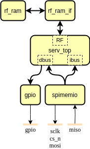

   

# Underserved

Underserved is a tiny RISC-V SoC that fits into two TinyTapeout tiles. It consists of the award-winning [SERV](https://github.com/olofk/serv), the world's smallest RISC-V CPU, a GPIO controller for setting an output pin and an XIP controller for running programs from an SPI Flash.

Wow! All this in just two TinyTapeout slots. Yes! ...but... there are some restrictions.

While we can read data and instructions from SPI Flash, there is no RAM for storing any data. SERV is small, but memories cost a lot of chip area. However, we can still store a few words of data in the GPR registers. Weeeell.. actually... implementing all the 31 32-bit words needed for RV32I, or even the 15 needed for RV32E would take up a considerable amount of space. So, right now Underserved only implements 4 GPR registers. Other than that though, it's a fully capable RISC-V SoC and I'm sure you can think up a lot of fun things to do with it.

- [Read the documentation for project](docs/info.md)

## What is Tiny Tapeout?

Tiny Tapeout is an educational project that aims to make it easier and cheaper than ever to get your digital and analog designs manufactured on a real chip.

To learn more and get started, visit https://tinytapeout.com.
