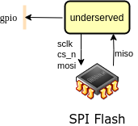

## How it works

When the system boots up, it will start accessing the SPI bus to set up a connected SPI Flash memory in XIP mode and start executing instructions from there. The GPIO can be used to output data, e.g. as a bitbanged UART.

## How to test

The testbench contains a model of an SPI Flash. A program in Verilog Hex format can be preloaded into the Flash model.

## External hardware

Expects a compatible SPI Flash. The XIP controller was stolen from [PicoSoC](https://github.com/YosysHQ/picorv32) which also contains some info about compatible SPI Flash components.
